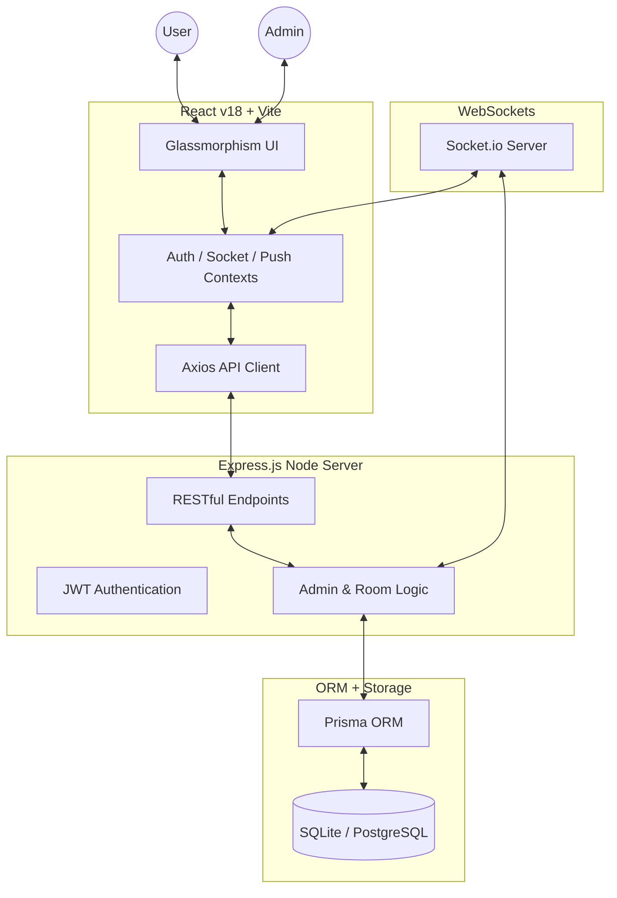

# 🚀 Roommate Connect (Production Deployment)

RoommateConnect is a premium, real-time platform designed to bridge the gap between people offering rooms and those seeking them. Built with a focus on trust, aesthetics, and lightning-fast communication.

🌐 Live: https://roommate.jay26.online

## 🚀 Core Features

- **Dual-Mode Listings**: Switch between "Offering a Room" (Owners) and "Seeking a Room" (Renters).
- **Real-Time Chat**: Direct, instant messaging with image sharing and "View Once" media.
- **Smart Filters**: Advanced location-based search (States/Cities) and price range filtering.
- **Push Notifications**: Never miss a match or message with browser-level push alerts.
- **Admin Command Center**: Complete oversight with real-time banning, broadcast alerts, and activity analytics.
- **Premium UX**: Glassmorphism UI, Skeleton screens for smooth loading, and responsive design for all devices.

---

## 🧠 Overview

This project focuses not only on development but on real-world deployment and system design using DevOps practices.

---

## ⚙️ Tech Stack

- Frontend: React (Vite)
- Backend: Node.js (Express)
- Database: PostgreSQL
- DevOps: Docker, Jenkins
- Server: AWS EC2
- Proxy: NGINX
- DNS: Route53 / Domain

---

## 🏗️ Architecture

User → Domain → NGINX → Frontend (Docker)
                        ↓
                    Backend (Docker)
                        ↓
                  PostgreSQL

---

## 🔄 CI/CD Pipeline

GitHub → Jenkins → Docker Build → Deployment

- Automatic deployment on code update
- Containerized services
- Zero manual deployment

---

## 🔐 Deployment Features

- Custom domain setup
- HTTPS enabled (SSL)
- Reverse proxy using NGINX
- Environment-based configuration

---

## 🧪 Real-World Debugging Experience

Handled production-level issues:

- Backend crash due to DB failure
- NGINX downtime
- Docker container failures
- API misconfiguration
- High CPU usage

---

## 🧠 Linux Administration

- System monitoring (CPU, RAM, Disk)
- Service management (Docker, NGINX)
- Log analysis
- Incident handling
- Backup & maintenance

---

## ⚠️ Note

This is a production-level project.  
Full source code is private but available upon request.

---

## 📸 Screenshots
## Website UI

## Jenkins pipeline

## AWS EC2

## Terminal (docker ps)

---

## 📬 Contact

Open to feedback and collaboration.
